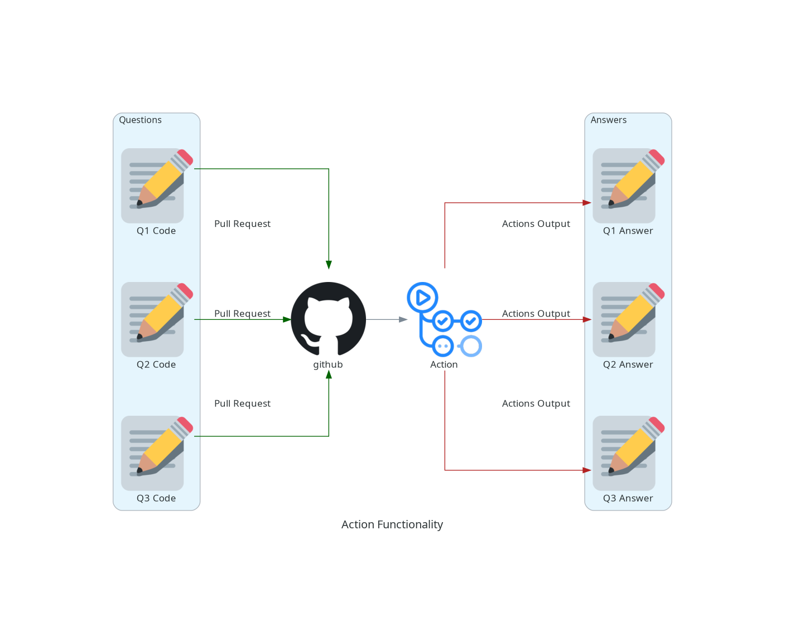

# assignment-corrector

## Objective

The objective of this action is to help the teacher of any language to correct your own activities using the github actions.

## How does it works

The idea is that the student will open a pull request to the repository of activities and them, given a set of tests, the action will run them on a container and compare the results between the two inputs.

You can take a look in the diagram below to see how the action works.



## Inputs

### `programming-language`

**Required** The name of the programming language that you want to use.
The name must be the same of the language of the answers file.

The languages supported are:
- `python`
- `javascript`
- `ruby`
- `rust`
- `c`
- `c++`
- `elixir`
- `fortran`

### `answer-location`

**Required** The url of the zip answers files and your inputs. The url must be located in a secret called `ANSWERLOCATION`.
The structure of the zip file has to be the following:

```
question_1/
    ├─── answer.py
    └─── input.txt
question_2/
    ├─── answer.py
    └─── input.txt
question_3/
    ├─── answer.py
    └─── input.txt
```
Note that the file format has to be the same as the programming language format. For example, if you are using python, the file format has to be `.py`.

## Outputs

## `time`

The time we received your task

## Use Cases

```
uses: actions/assignment-corrector@v0.0.1-alpha
with:
    programming-language: 'python'
    answer-location: ${{ secrets.AnswerLocation }}
```
